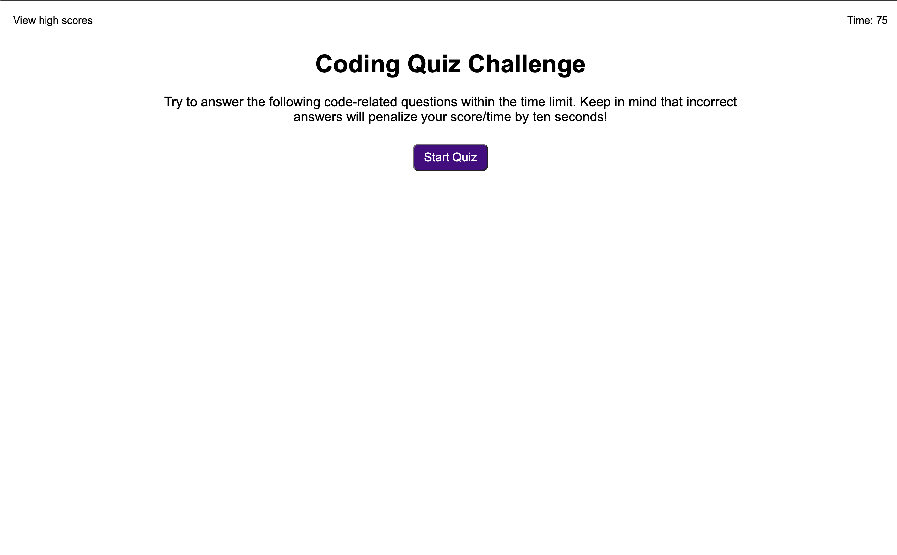
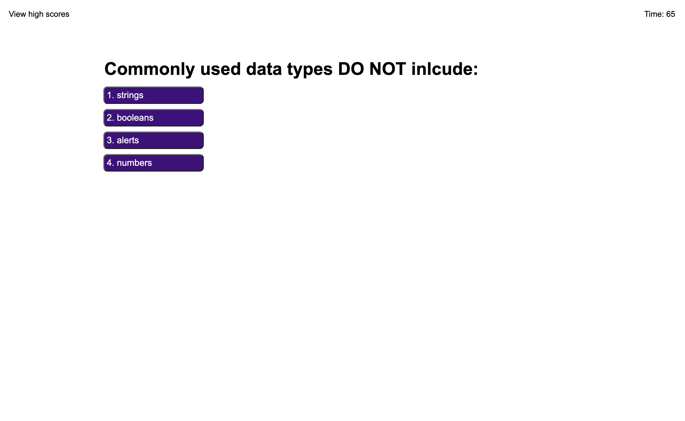
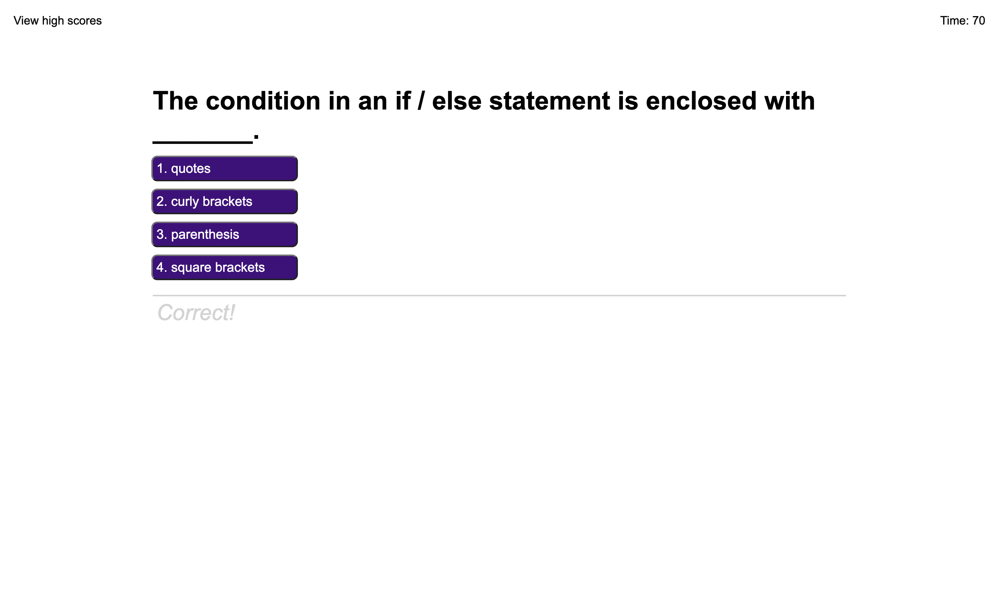
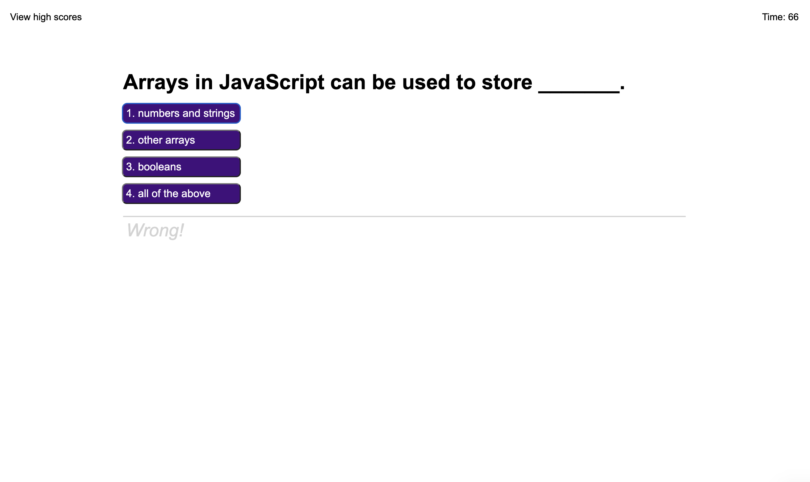
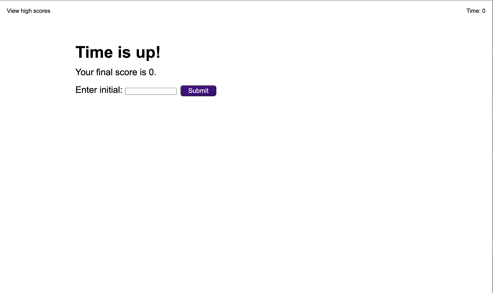
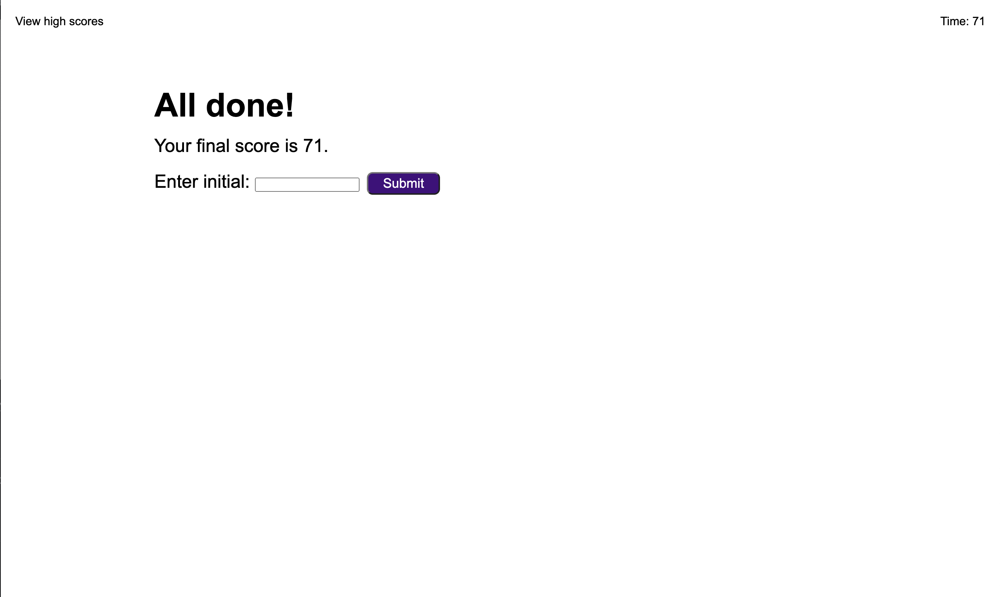
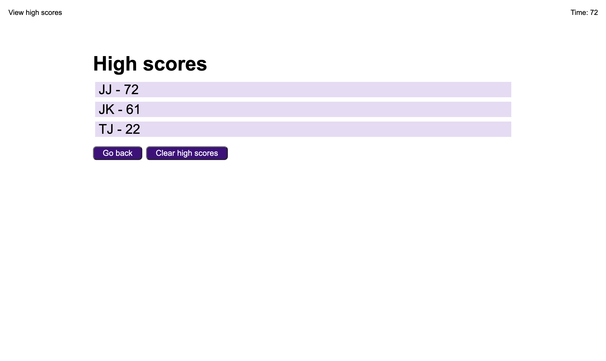

# Module 4 Challenge Web APIs: Code Quiz

## Description

This is a Code Quiz application that heavily implements JavaScript and web APIs. When the "Start Quiz" button is pressed, then the timer starts counting down. With every wrong answer, 10 seconds is deducted from the timer/score. Every time a question is answered, another question is displayed. An answer feedback is displayed each time a multiple choice is clicked on. At the end of the quiz, the user can enter their initials and save their score! All these elements are implemented using JavaScript and web APIs.   

## Usage

To start the quiz, simply click the "Start Quiz" button.

The first question will then be displayed and the timer will start counting down. 

After answering the question, another question is displayed.

When answering a question, the application will tell the user whether it is correct or wrong. If the question was answered wrong, ten seconds will be deducted from the timer/score. The quiz will end if the timer hits 0 before the user answers all the questions. 

The remaining time left is the final score. The user can then save their initials and score to the high score board. A link to the high scores page is at the top left hand corner and can be viewed at any time. 

Link to deployed application: https://monicapong.github.io/challenge4 

## License

Please refer to the GitHub Repository for licensing information.
Link to GitHub repository: https://github.com/monicapong/challenge4